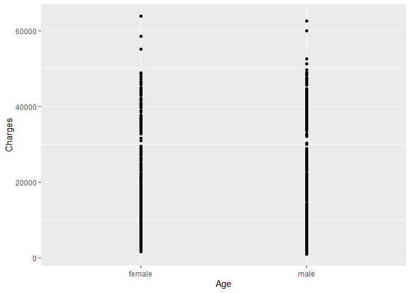

R Notebook for visualisations
================

-   [Including Plots](#including-plots)
-   [Data extraction, transformation and loading](#data-extraction-transformation-and-loading)
    -   [Packages loaded](#packages-loaded)
    -   [Data loading](#data-loading)
-   [Visualization](#visualization)

This is an R Markdown document. Markdown is a simple formatting syntax for authoring HTML, PDF, and MS Word documents. For more details on using R Markdown see <http://rmarkdown.rstudio.com>.

When you click the **Knit** button a document will be generated that includes both content as well as the output of any embedded R code chunks within the document. You can embed an R code chunk like this:

Including Plots
---------------

You can also embed plots, for example:


Note that the `echo = FALSE` parameter was added to the code chunk to prevent printing of the R code that generated the plot.

Data extraction, transformation and loading
===========================================

Packages loaded
---------------

Data loading
------------

``` r
insurance = read.csv("c:/users/denat/ProjectBiBC/Data/insurance.csv")
head(insurance)
```

    ##   age    sex    bmi children smoker    region   charges
    ## 1  19 female 27.900        0    yes southwest 16884.924
    ## 2  18   male 33.770        1     no southeast  1725.552
    ## 3  28   male 33.000        3     no southeast  4449.462
    ## 4  33   male 22.705        0     no northwest 21984.471
    ## 5  32   male 28.880        0     no northwest  3866.855
    ## 6  31 female 25.740        0     no southeast  3756.622

Visualization
=============

``` r
install.packages("ggplot2", repos = "http://cran.us.r-project.org")
```

    ## Installing package into 'C:/Users/denat/OneDrive/Documents/R/win-library/3.5'
    ## (as 'lib' is unspecified)

    ## also installing the dependencies 'isoband', 'rlang'

    ## 
    ##   There are binary versions available but the source versions are
    ##   later:
    ##         binary source needs_compilation
    ## isoband  0.2.1  0.2.2              TRUE
    ## rlang    0.4.5  0.4.7              TRUE
    ## ggplot2  3.3.0  3.3.2             FALSE
    ## 
    ##   Binaries will be installed
    ## package 'isoband' successfully unpacked and MD5 sums checked
    ## package 'rlang' successfully unpacked and MD5 sums checked
    ## 
    ## The downloaded binary packages are in
    ##  C:\Users\denat\AppData\Local\Temp\Rtmpwr7NlX\downloaded_packages

    ## installing the source package 'ggplot2'

``` r
library(ggplot2)
library(gridExtra)

(bmi_plot = qplot(bmi, charges, data = insurance, xlab = "BMI", ylab = "Charges") + geom_vline(xintercept = 18.5, color = "red") + geom_vline(xintercept = 24.9, color = "red"))
```


``` r
bmi_plot
```


``` r
age_plot = qplot(age, charges, data = insurance, xlab = "Age", ylab = "Charges", col = sex)
sex_plot = qplot(sex, charges, data = insurance, xlab = "Age", ylab = "Charges")

plot1 = grid.arrange(bmi_plot, age_plot, sex_plot, ncol=1 )
```


``` r
plot1
```

    ## TableGrob (3 x 1) "arrange": 3 grobs
    ##   z     cells    name           grob
    ## 1 1 (1-1,1-1) arrange gtable[layout]
    ## 2 2 (2-2,1-1) arrange gtable[layout]
    ## 3 3 (3-3,1-1) arrange gtable[layout]

``` r
sex_boxplot = ggplot(insurance, aes(x=sex, y=charges)) + geom_boxplot()
region_boxplot = ggplot(insurance, aes(x=region, y=charges)) + geom_boxplot() + theme(axis.text.x = element_text(angle = 90, hjust = 1))
children_boxplot = ggplot(insurance, aes(x=as.factor(children), y=charges)) + geom_boxplot() + labs(x="# of children")
smoker_boxplot = ggplot(insurance, aes(x=smoker, y=charges)) + geom_boxplot()

grid.arrange(children_boxplot, sex_boxplot, smoker_boxplot, region_boxplot, ncol=2 )
```


